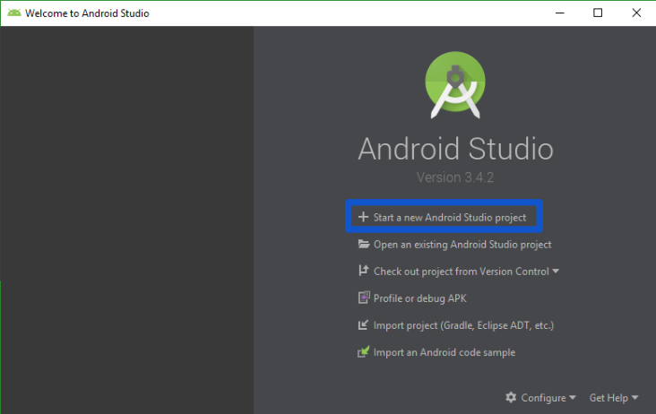
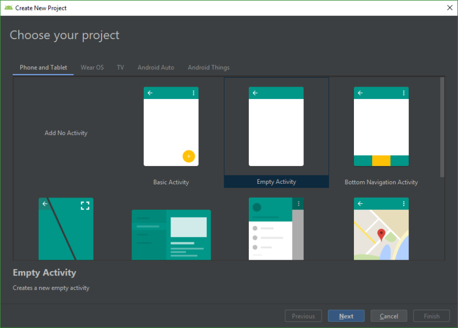
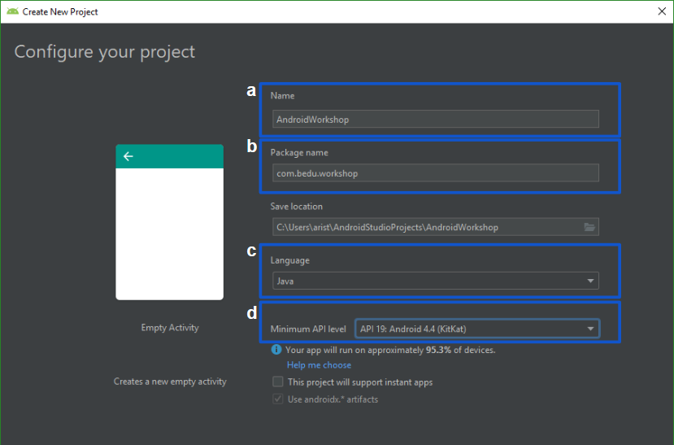
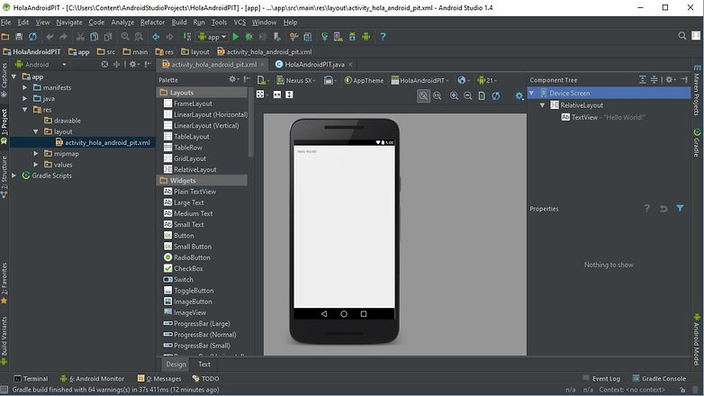

## Sesion 01 - Ejemplo 01

### OBJETIVO 
 - El alumno creará su primera apliación en Android Studio. 

#### REQUISITOS 
* Android Studio instalado

#### DESARROLLO
La primera vez que iniciamos Android Studio nos monstrará una pantalla de bienvenida parecida a la que tenemos aquí abajo.

1. Para empezar a crear un proyecto nuevo, seleccionamos la opcion **Start a new Android Studio Project**.
 

 2. A continuación elegimos el templete para nuestra apliación, en nuestro caso elegimos **“Empty Activity”**.
 
 ### **Nota:**

 Primero dominaremos los templetes básicos,posteriormente podrás intentar con otros estilos de templetes.
 
 

 3. Vamos a configurar nuestro proyecto.

    a. Ingresamos un nombre para nuestra apliación.

    b. Ingresamos un nombre para tu equipo. **(Todo tu equipo debe usar el mismo nombre).**

    c. Selecionar **Java** como lenguaje de la aplicación.

    d. En la opción Minimum API level, seleccionar el SDK: **KitKat**

 

 4. Una vez creado el proyecto, vamos a tener la siguiente ventana, donde en la parte izquierda encontramos el árbol con las carpetas y archivos del proyecto.
 
  

