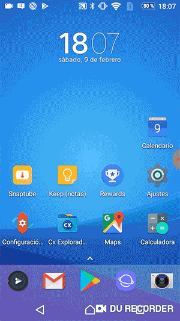

## Sesion 01 - Ejemplo 02

### OBJETIVO 
 - El alumno aprenderá a correr una aplicación en Android Studio. 

#### REQUISITOS 
* Android Studio instalado

#### DESARROLLO
Activa el modo desarrollador: 

Configuración
Sistema
Acerca del teléfono
Número de compilación

1. Ir al panel de configuración o ajustes

2. Ir al panel de sistema

3. Ir al panel de acerca del teléfono

4. Presiona varias veces en la opción Número de compilación hasta que te diga que ya eres desarrollador.

    

## Si no tienes un teléfono Android:

1. Dar clic en **Compilar** y **Ejecutar** la aplicación.

    

2. Elegir la opción **“Create new virtual device”**

3. Dar clic en **next** hasta que te aparesca la opción **download** y dar clic en **finish**.

## Compilar nuestra aplicación

1. Conecta tú teléfono a tú computadora.
2. Dar clic en **Compilar** y **Ejecutar** la aplicación.

    
3. Elige tu teléfono (o emulador) de la lista).