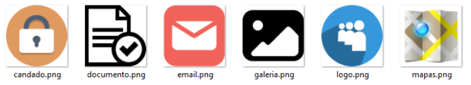
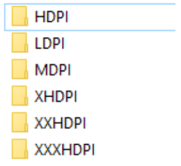
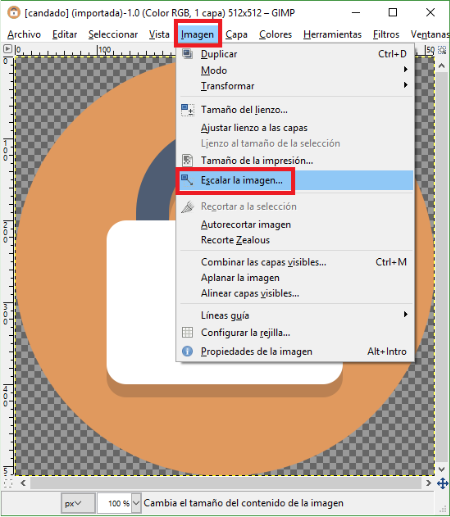
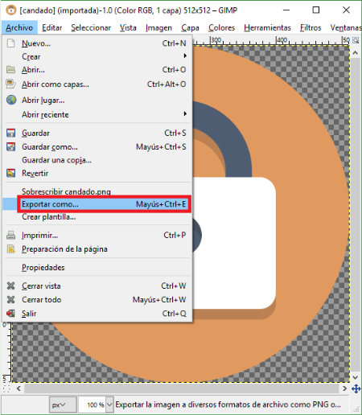
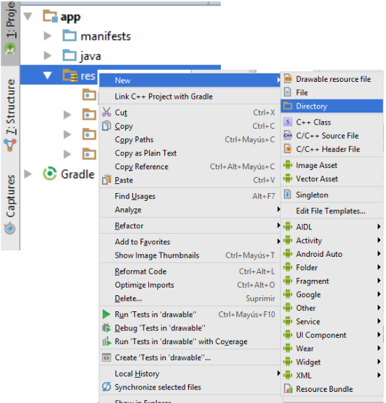
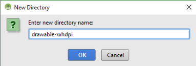
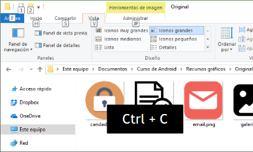
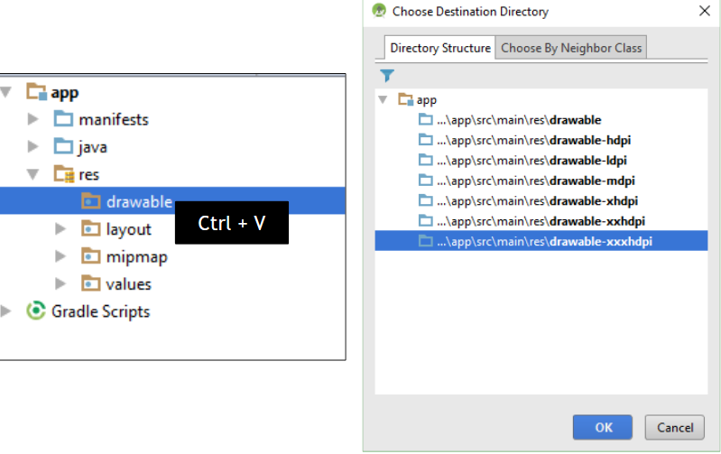
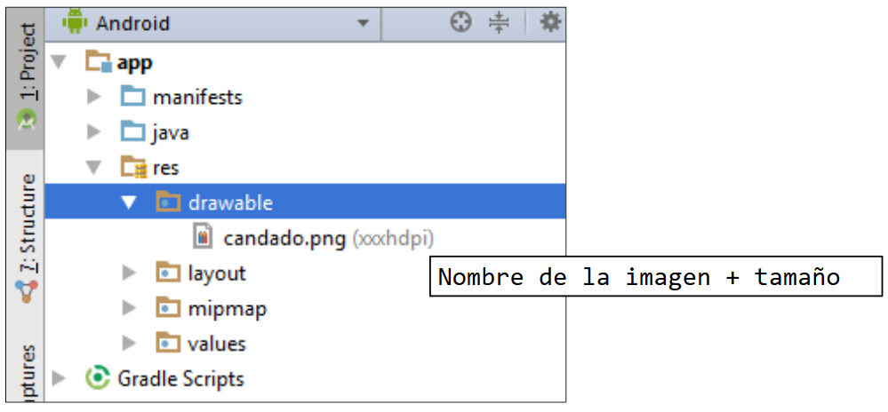

## Sesion 02 - Ejemplo 01

### OBJETIVO 
 - Crear recursos para nuestro proyecto

#### REQUISITOS 
1. Android Studio 

#### DESARROLLO
1. Redimensionar las imagenes en la carperta de recursos gráficos.

2. Todas las imágenes deben tener el mismo **nombre**, pero estar en carpetas dirferentes carpetas.

**Importante:**

- **XXXHDPI:** No tienes que hacer nada 
- **XXHDPI:** Tamaño x 0.75
- **XHDPI:** Tamaño x 0.5
- **HDPI:** Tamaño x 0.375
- **MDPI:** Tamaño x 0.25
- **LDPI:** Tamaño x 0.1875

    

## Utilizar GIMP para crear imágenes rápidamente.

1. Abrir GIMP
2. Nos dirigimos a la pestaña **Imagen** y seleccionamos la opción **Escalar la imagen**.

 

 3.  Nos dirigimos a la pestaña **Archivo** y seleccionamos la opción **Exportar como**.

  
  

  ### Crear las carpetas del proyecto

  1. Del panel izquierdo seleccionamos la carpeta **res**, dar clic izquierdo y seleccionar la opción **new** y a continuación la opción **Directory**.
  
  

  2. Agregamos un nombre a nuestro directorio.

  

  **Nota:**

  Los folders que deben crearse son los siguientes:
* drawable-xxxhdpi
* drawable-xxhdpi
* drawable-xhdpi
* drawable-hdpi
* drawable-mdpi
* drawable-ldpi

*No va a aparecer ningún folder todavía en tu proyecto. Aparecerán cuando insertes las imágenes.*

### Copiar imágenes al proyecto
1. Vamos a copiar nuestra imágenes.

  

2. Pegar nuestras imágnes en la carpeta **drawable**, que se encuentra en el panel izquierdo de nuestro proyecto.

  

  ### Resultado
  1. Como resultado obtenemos:
        * El nombre de la imagen y su tamaño. 

  

¡Buena suerte en el reto!
