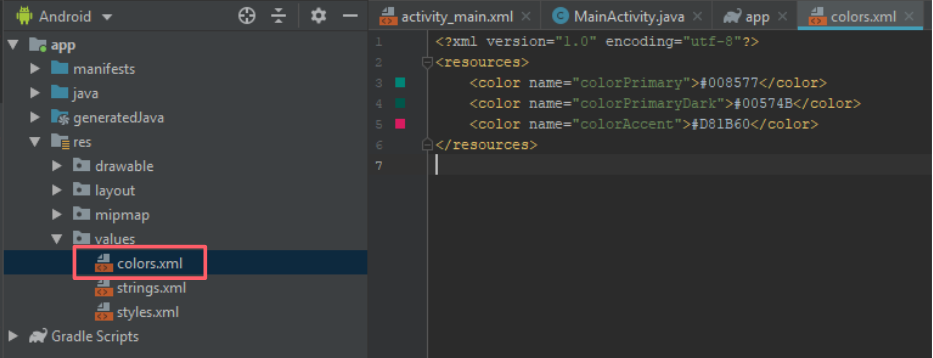
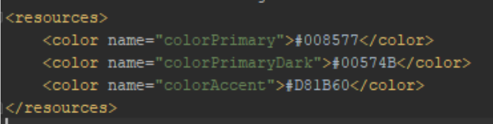

## Sesion 02 - Ejemplo 02

### OBJETIVO 
 - Cambiar los colores de nuestra aplicación.

#### REQUISITOS 
1. Android Studio 

#### DESARROLLO
**Nota**

* Puedes moficar los colores con formato hexadecimal.
* Si modificas un color, se agregará en toda la App.
* Puedes buscar en Google "RGB to Hex" para obtener una paleta de colores

1. En la parte izquierda del panel dentro de la carpeta **res**, seleccionamos la subcarpeta **values** y seleccionamos el archivo **colors.xml**.

2. Ingresamos los colores que deseamos para nuestra aplicación.

