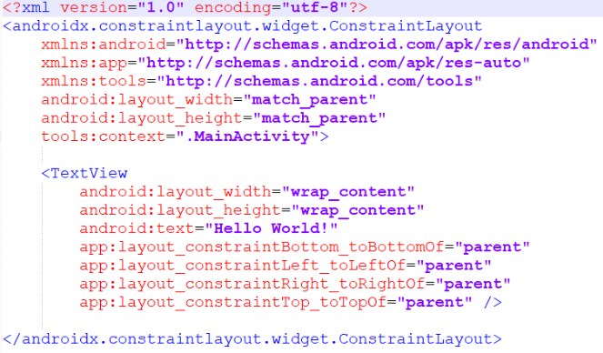

## Sesion 03 - Ejemplo 01

### OBJETIVO 
 - Comprender los fundamentos del diseño Lineal en android.

#### REQUISITOS 
1. Android Studio 

#### DESARROLLO

1. En la siguiente pantalla se muestra el contenido de **activity_main.xml**.

2. Modifica el código, para que se muestre igual al ejemplo de la siguiente pantalla. 

##### Qué nos quiere decier este código

### Propiedades de un código XML.

Cuenta con 4 propiedades.

* Width
* Height 
* Orientation
* Gravity 

### Propiedad Width

### Propiedad Height

### Propiedad Width y Height

### Propiedad Width y Height

### Propiedad Orientation

### Propiedad Orientation

### Propiedad Gravity

