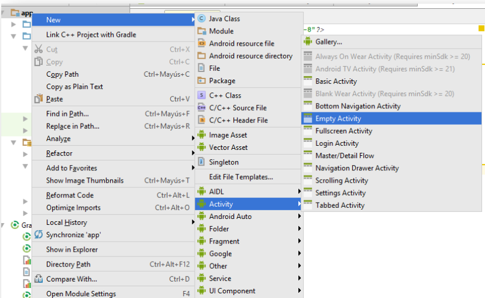

 ## Sesion 03 - Ejemplo 02

### OBJETIVO 
 - El alumnos aprenderá a crear actividades en android. 

#### REQUISITOS 
1. Android Studio

#### DESARROLLO

1. En el panel izquierdo de nuestro proyecto, seleccionamos la carpeta **app**.
2. Dar clic izquierdo, selecciona la opción **New** y da clic en la opción **Activity**.
3. Seleccionamos la opción **Empty Activity** y le agremamos el siguiente nombre: **login_activity.xml**
    

