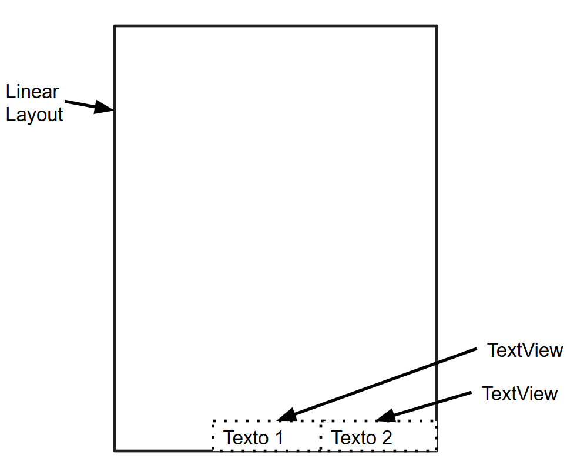

 ## Sesion 03 - Ejemplo 02

### OBJETIVO 
 - En este ejemplo vemos que pasa si agregas varios objetos dentro de un Linear Layout. 

#### REQUISITOS 
1. Android Studio
2. Conocimientos de strings.xml

#### DESARROLLO
A continuación vamos a crear una estructura como la que se muestra en la siguiente pantalla.

