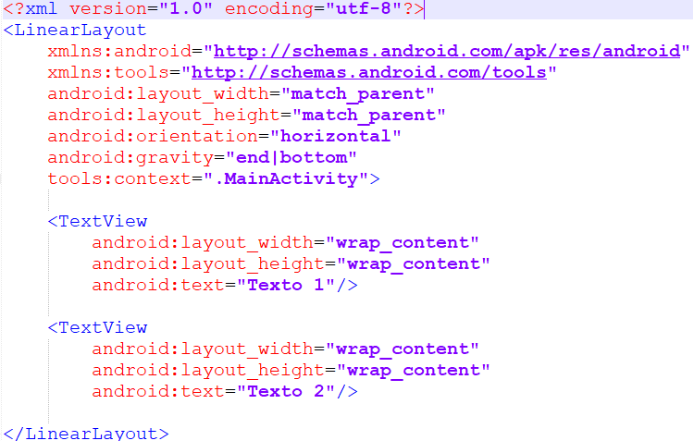

 ## Sesion 03 - Reto 01

### OBJETIVO 
 - En este ejemplo vemos que pasa si agregas varios objetos dentro de un Linear Layout. 

#### REQUISITOS 
1. Android Studio
2. Conocimientos de strings.xml

#### DESARROLLO
A continuación vamos a crear el una estructura como la que se muestra en la siguiente pantalla, con los conicimientos aprendidos anteriormente.

Solución

 
A continuación se muestra el código, para resolver el ejercicio visto anteriormente.
  

