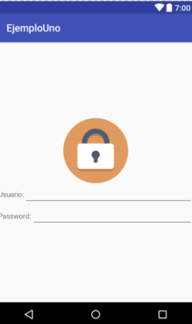
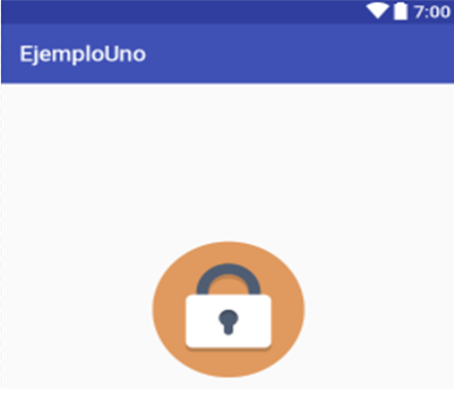
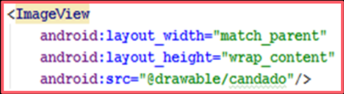

## Sesion 03 - Reto 02

### OBJETIVO 
 - Crear una interfaz gráfica que contenga un login para nuestra aplicación.

#### REQUISITOS 
1. Android Studio

#### DESARROLLO

1. Crear una interfaz gráfica que contenga un login que contenga:
    - **Nombre de usuario.** (Correo electrónico).

        **Tip:**
        Existe una propiedad para el campo email.

    - **Contraseña.** .

        **Tip:**
        Existe una propiedad para el campo password.

2. Agregaremos la imagen de nuestro login.

**Recurda:**

Utilizamos **ImageView** para agregar imagénes:

**Tip:**

Puedes ajustar el tamaño de tus imágenes utilizando dependient pixels (dp) que se ajustan al tamaño del smartphone:

Código

3. Agregaremos los campos de:
    - Nombre de Usuario
    - Contraseña

