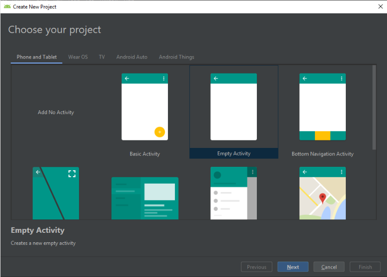
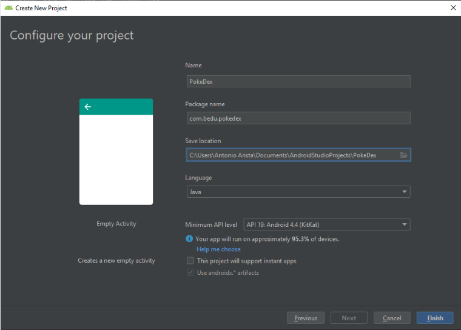
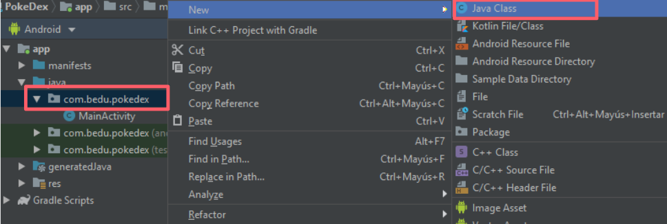
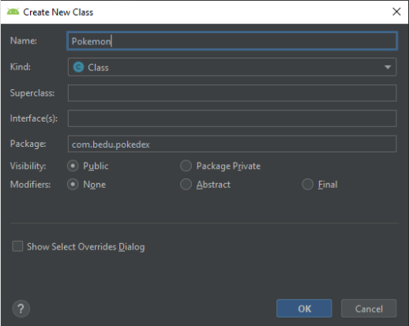
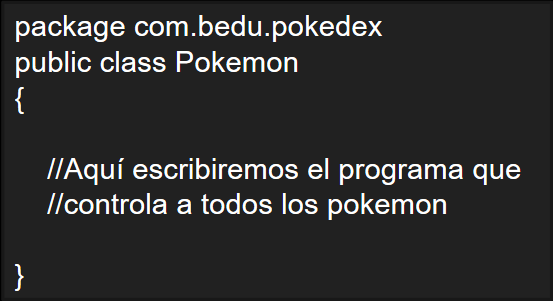

## Sesión 04 - Ejemplo 01

### OBJETIVO 
 - En este ejemplo creamos una clase por primera vez. 

#### REQUISITOS 
1. Android Studio
2. Conocimientos elementales de programación. 

#### DESARROLLO
Vamos a crear un nuevo proyecto con la temática de **Pokémon.**

1. Crear una nueva proyecto. **(Empty Activity).**

2.  Configuramos nuestro proyecto con las siguientes propiedades.
    - **Nombre:** PokeDex
    - **Packege Name:** com.bedu.pokedex
    - **Lenguage:** Java
    - **Minimum API Level** KitKat

3. Crear un archivo de texto llamado **Pokemon.java**

4. Asignar a nuestro archivo el nombre de **Pokemom**

**Nota:**

Sin el .java

5. Dentro de **Pokemon.java** tenemos la siguiente estructura de código:
    - **package:** este programa pertenece a un grupo llamado “com.bedu.pokedex”.

    - **class:** Lo que se describe entre llaves ({ }) se llamará “Pokémon”, y es un molde para crearlos a todos los demas pokémon.

    - public: Esto lo veremos mas adelante.

