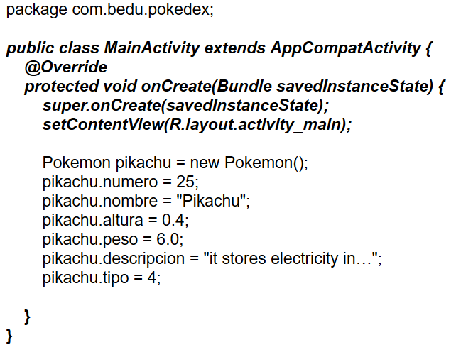

## Sesion 04 - Ejemplo 02

### OBJETIVO 
 - Aprenderás acerca de atributos de una clase.

#### REQUISITOS 
1. Android Studio
2. Conocimientos elementales de programación. 

#### DESARROLLO
1. Abre el archivo **MainActivity.java**
2. Dentro de **Main.java** define un pokémon (que no sea Pikachu).

**Nota**
(Lo que está en cursivas déjalo como está, se explicará más adelante).

