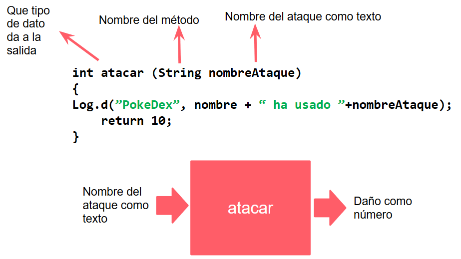

## Sesion 04 - Ejemplo 03

### OBJETIVO 
 - Aprenderemos acerca de Métodos.

#### REQUISITOS 
1. Android Studio
2. Conocimientos elementales de programación.  

#### DESARROLLO
##### Nuestro pokémon van a pelear !!!
1. Agregar un método (o función) que se encargará de hacer un ataque.
    - **Recibirá:** El nombre del ataque.
    - **Regresará:** El daño que va a hacer.

#### Código:

```java
package com.bedu.pokedex;
public class Pokemon
{
    int numero;
    String nombre;
    double altura;
    double peso;
    String descripcion;
    int tipo;   
    int HP;

   int atacar (String nombreAtaque)
   {
       Log.d(”PokeDex”,nombre + "ha usado" + nombreAtaque);
       return 10;  
   }
}
}
```
**Tip:**

* A continuación se explica el método **Atacar**




