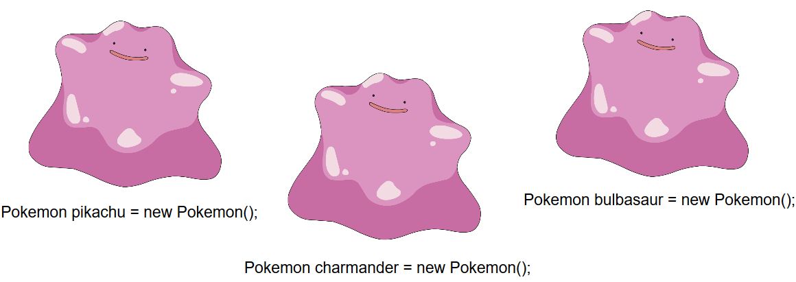

## Sesion 04 - Reto 01

### OBJETIVO 
 - Crear un objeto en MainActivity.java 
 
#### REQUISITOS 
1. Android Studio
2. Conocimientos básicos de programación. 

#### DESARROLLO
1. Crear un nuevo Pokémon, para ello utilizaremos la sentencia **new.**
    -   **Ejemplo:**

        *Pokemon charmander = new Pokemon();*

### ¿Por qué todos se ven igual?

* Si no editas los atributos, todos los pokémon son el mismo molde y son iguales.

* Es importante que le pongas los atributos adecuadamente.

