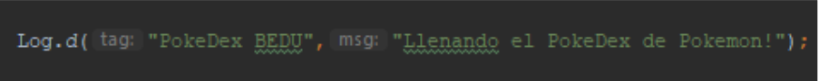
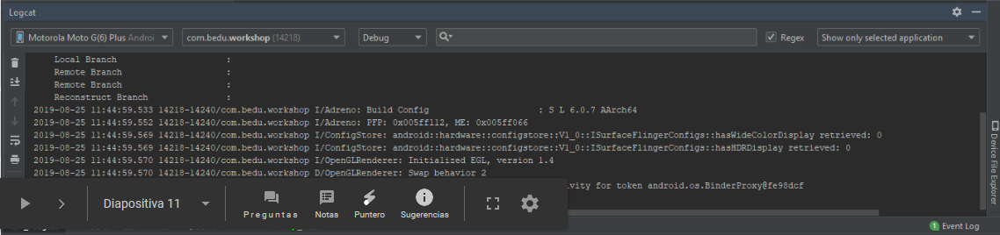
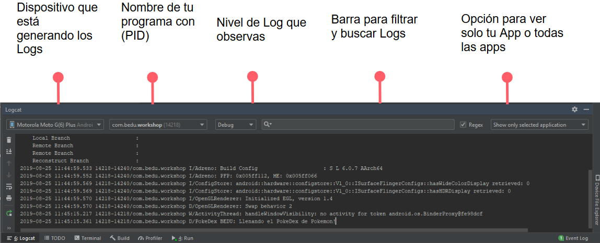
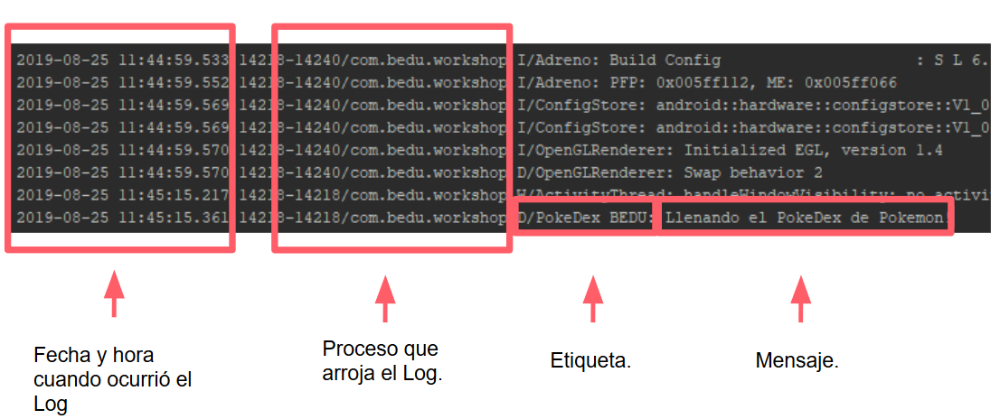

`Desarrollo Mobile con Java` > `Sesión 05`

## ¡Arreglemos problemas con Logcat! 

### OBJETIVO 
 - Aprender a utilizar Logcat para identificar errores y ver cómo se comporta en la App. 

#### DESARROLLO

**¿Por qué es importante utilizar el Logcat?**  
- Es común que no sepamos dónde falla algo.  
- Esto puede traer frustración. ☹   
- Podemos usar Log para ver cómo se comporta la App.  
- El usuario nunca verá lo que hay en Log.  

**Partes del Logcat:**

 

 
 **Partes del Logcat (parte 2)**
 
 
